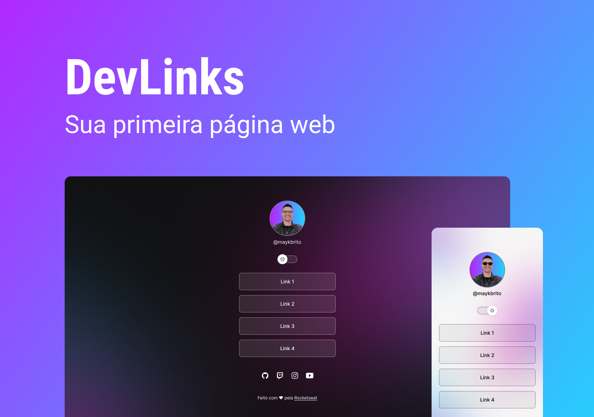

<h1 align="center"> DevLinks </h1>

Hello! This project is part of an exclusive and free program promoted by Rocketseat for teaching WEB technologies.  

Modifications were made to the original layout for the project to be just the way I wanted it 🙂  

Study this project in video format by clicking <a href="https://lp.rocketseat.com.br/devlinks/inscricao?utm_source=github&utm_medium=descricao&utm_campaign=capture-devlinks&utm_term=organic&utm_content=descricao-github-mayk-brito">here.</a>

  <a href="#-project">Project</a>&nbsp;&nbsp;&nbsp;|&nbsp;&nbsp;&nbsp;
  <a href="#-technologies">Technologies</a>&nbsp;&nbsp;&nbsp;|&nbsp;&nbsp;&nbsp;
  <a href="#-layout">Layout</a>&nbsp;&nbsp;&nbsp;|&nbsp;&nbsp;&nbsp;
  <a href="#memo-license">License</a>

  

 

  

## 💻 Project

DevLinks is a link aggregator to use as an online business card.

- [Access the finished project](https://gabriela-sp.github.io/Dev-Links/)

## 🚀 Technologies

This project was developed with the following technologies:

- HTML and CSS
- JavaScript
- Git and Github
- Figma

## 🔖 Layout

You can see the layout of the project through [THIS LINK](https://www.figma.com/community/file/1187422022288947321). It's necessary to have a [Figma](https://figma.com) account to have access.

## :memo: License

This project is under a MIT license.

---

Made with ♥ by Rocketseat :wave: [Join our community!](https://discord.gg/rocketseat)
